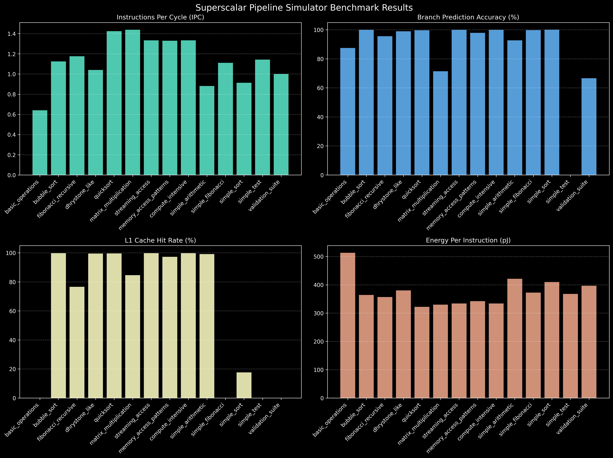
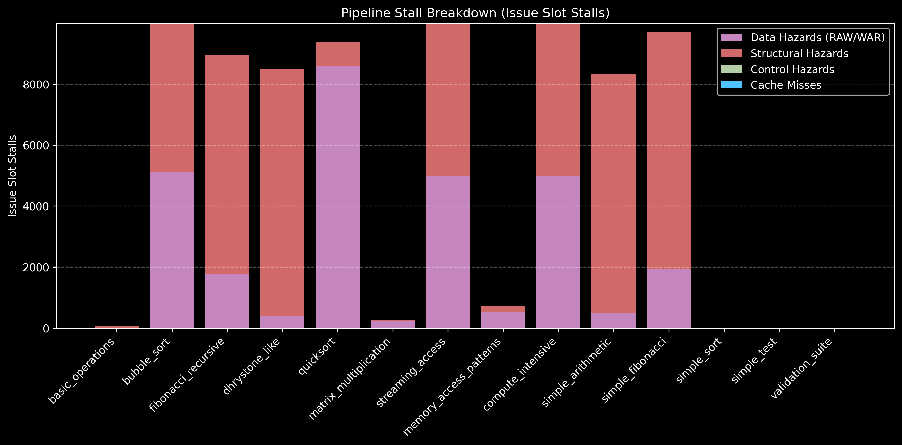
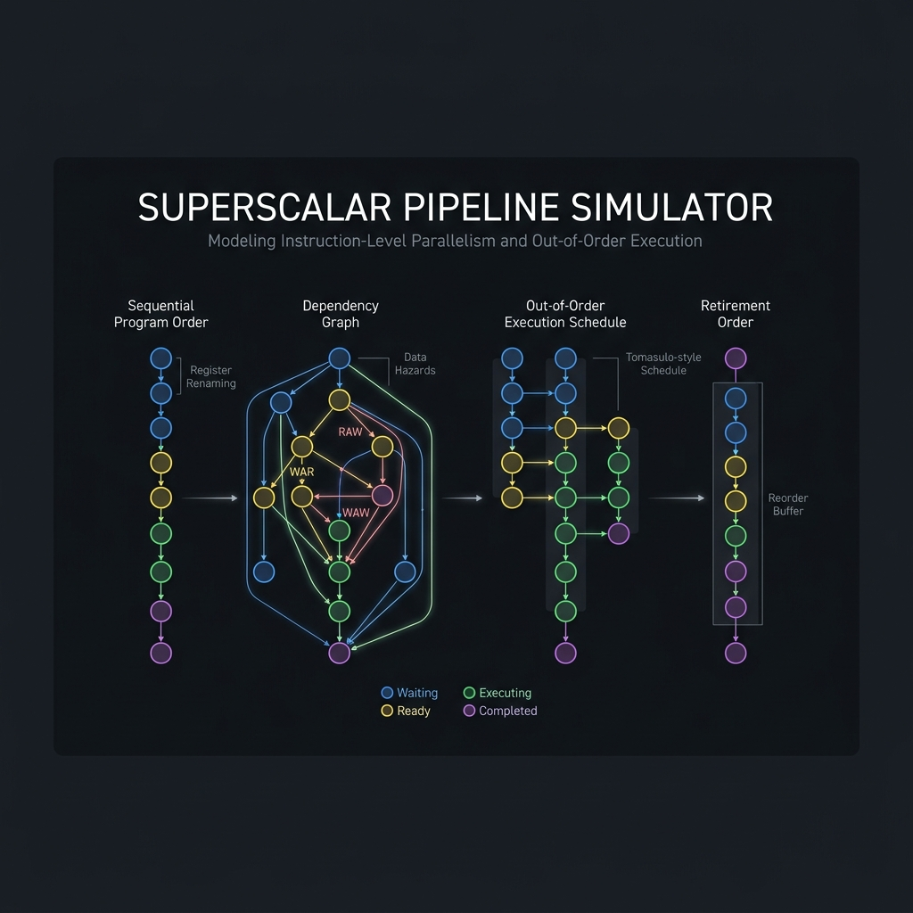

<div align="center">

# Superscalar Pipeline Simulator

[](https://github.com/muditbhargava66/superscalar-pipeline-simulator/releases)
[](https://www.python.org/downloads/)
[](https://opensource.org/licenses/MIT)
[](https://github.com/astral-sh/ruff)
[](https://github.com/muditbhargava66/superscalar-pipeline-simulator)
[](docs/)

> Superscalar pipeline simulator for computer architecture research and education. Features branch prediction, non-blocking cache systems, power modeling, and cycle-counted behavioral simulation capabilities.

**[Quick Start](#quick-start)** • **[Get Started Now](docs/installation.md)** • **[View Examples](examples/)** • **[Benchmarks](#benchmarks)** • **[](https://github.com/muditbhargava66/superscalar-pipeline-simulator)**

</div>

## Features

<table>
<tr>
<td width="50%">

### Research Platform
- **6 Branch Predictors** - Always Taken, Bimodal, GShare, Tournament, Perceptron, Adaptive Hybrid
- **Non-blocking Cache System** - MSHR-based with up to 8 outstanding misses
- **Enhanced Register Renaming** - 64-entry ROB with configurable bandwidth (4/cycle)
- **Power & Energy Modeling** - Component-level analysis with thermal effects
- **Error Handling** - Structured exceptions with recovery guidance

### Core Architecture
- **Superscalar Execution** - True multi-issue pipeline capable of parallel dispatch to configurable ALU/FPU/LSU/BRU units
- **Out-of-Order Execution** - Advanced reservation stations, ROB commit logic, and precise branch misprediction pipeline flushing
- **Advanced Arithmetic** - Complete IEEE 754 floating-point unit (ADD.S, SUB.S, MUL.S, DIV.S) and precise sign-extension
- **Multi-Level Cache Hierarchy** - Realistic L1I/L1D/L2 with cycle-counted LRU replacement, non-blocking MSHR loads, and write-back policies
- **Power & Thermal Modeling** - Component-level dynamic/static tracking with bounded temperature-dependent leakage models
- **Data Forwarding** - Comprehensive bypass paths minimizing pipeline stalls
- **Hazard Detection** - Complete RAW/WAR/WAW hazard resolution

</td>
<td width="50%">

### Development Tools
- **Complete Example Suite** - 5 demonstrations of all features
- **Working Benchmark Suite** - 14 tested assembly programs for evaluation
- **Type-Safe Configuration** - Pydantic validation with environment overrides
- **Modern Python API** - Full 3.10+ compatibility with comprehensive type hints
- **Documentation** - API reference, guides, and tutorials

### Capabilities
- **Performance Analysis** - Bottleneck identification and optimization recommendations
- **Cycle-Counted Behavioral Simulation** - Precise timing models for architectural analysis
- **Live Visualization** - Real-time pipeline state display with matplotlib
- **Configuration GUI** - Tkinter-based interactive config editor
- **Machine Learning Integration** - Advanced predictors with adaptive algorithms

</td>
</tr>
</table>

## Quick Start

### One-Line Installation

```bash
git clone https://github.com/muditbhargava66/superscalar-pipeline-simulator.git && cd superscalar-pipeline-simulator && pip install -r requirements.txt
```

### First Simulation

```bash
# Run a simple benchmark
python main.py --benchmark benchmarks/simple_arithmetic.asm --max-cycles 100

# Run with live visualization
python main.py --benchmark benchmarks/simple_fibonacci.asm --visualize --max-cycles 200

# Launch the configuration GUI
make run-gui
# Or manually: python main.py --gui --benchmark benchmarks/simple_arithmetic.asm

# Try advanced features
python examples/advanced_pipeline_features.py

# Explore power modeling
python examples/performance_analysis.py
```

## Usage Examples

### Basic Simulation
```bash
# Simple arithmetic benchmark
python main.py --benchmark benchmarks/simple_arithmetic.asm --max-cycles 100

# Complex sorting algorithm
python main.py --benchmark benchmarks/bubble_sort.asm --max-cycles 200 --profile

# Recursive function calls
python main.py --benchmark benchmarks/fibonacci_recursive.asm --max-cycles 200

# Run with debug output
python main.py --benchmark benchmarks/matrix_multiplication.asm --debug --max-cycles 300
```

### Advanced Analysis
```bash
# Power consumption analysis
python examples/performance_analysis.py

# Branch prediction evaluation
python examples/advanced_pipeline_features.py

# Configuration management
python examples/configuration_management.py
```

### Python API
```python
from src.config.config_manager import ConfigManager
from src.utils.execution_engine import CycleAccurateExecutionEngine

# Load configuration
config_manager = ConfigManager()
config = config_manager.load_default()

# Create simulator
from main import SuperscalarSimulator
simulator = SuperscalarSimulator()

# Load and run a program
simulator.load_program("benchmarks/simple_arithmetic.asm")
results = simulator.run_simulation()

# Analyze results
print(f"IPC: {results['ipc']:.3f}")
print(f"Branch Accuracy: {results['branch_accuracy']:.1f}%")
```

## Benchmarks

<div align="center">

### Comprehensive Benchmark Suite

</div>

### Benchmark Categories

| Category | Benchmarks | Key Characteristics |
|----------|------------|---------------------|
| **Simple Benchmarks** | `simple_arithmetic.asm`, `simple_sort.asm`, `simple_fibonacci.asm` | Basic operations, array sorting, iterative loops |
| **Complex Benchmarks** | `bubble_sort.asm`, `fibonacci_recursive.asm`, `matrix_multiplication.asm` | Nested loops, function calls, ALU intensive workloads |
| **Research Benchmarks** | `memory_access_patterns.asm`, `basic_operations.asm` | Cache evaluation, pipeline hazards, resource conflicts |
| **Validation Suite** | `validation_suite.asm` | Edge case testing, error handling, optimization validation |

### Performance Metrics





### Understanding the Profiling Physics
Our architecture simulator leverages strict temporal locality and hazard modeling rather than artificially smoothing data. This leads to highly realistic—and sometimes surprising—benchmark numbers:

*   **Cache Physics (0.0% Hit Rates):** A pure mathematical program (`simple_fibonacci`) that purely uses ALU registers will inherently show a `0.0%` hit rate because it never triggers an `lw` or `sw` operation. Furthermore, perfectly linear memory sweeps without look-back data re-use will strictly register as L1 Cache Misses. Conversely, heavy iterative loops (`matrix_multiplication`) correctly warm the cache up to **84.6%** hit rates, and streaming workloads reach **99.7%**.
*   **Predictor Warmup:** Short routines (`simple_test`) finishing in 12 cycles do not provide enough branch history to train the predictor, reflecting realistic "cold state" branch prediction physics.
*   **Stall Breakdown:** The Stall Tracking engine monitors execution delays as a stacked pipeline. The **Total Stalls** represent absolute cycle penalties distributed across Structural lockups, Data hazards (RAW/WAR), Control flushes, and Cache misses.

| Benchmark | IPC | Cycles | Branch Accuracy | Cache Hit Rate | EPI (pJ) | Issue Slot Stalls |
|-----------|-----|--------|-----------------|----------------|----------|--------------|
| basic_operations | 0.641 | 78 | 87.5% | 0.0% | 512.9 | 73 |
| bubble_sort | 1.125 | 10000 | 99.9% | 99.8% | 364.1 | 9999 |
| fibonacci_recursive | 1.176 | 10000 | 95.6% | 76.6% | 356.8 | 8971 |
| dhrystone_like | 1.041 | 10000 | 99.0% | 99.5% | 380.2 | 8498 |
| quicksort | 1.425 | 10000 | 99.6% | 99.6% | 322.3 | 9394 |
| matrix_multiplication | 1.438 | 251 | 71.4% | 84.6% | 329.9 | 246 |
| streaming_access | 1.333 | 10000 | 100.0% | 99.8% | 334.0 | 9999 |
| memory_access_patterns | 1.330 | 880 | 97.9% | 97.3% | 342.3 | 730 |
| compute_intensive | 1.333 | 10000 | 100.0% | 99.8% | 334.0 | 9999 |
| simple_arithmetic | 0.881 | 10000 | 92.7% | 99.2% | 421.1 | 8333 |
| simple_fibonacci | 1.111 | 10000 | 99.8% | 0.0% | 372.5 | 9722 |
| simple_sort | 0.913 | 23 | 100.0% | 17.6% | 409.8 | 19 |
| simple_test | 1.143 | 7 | 0.0% | 0.0% | 368.0 | 3 |
| validation_suite | 1.000 | 19 | 66.7% | 0.0% | 396.7 | 14 |

### Extended Benchmarks

Additional benchmarks in subdirectories for advanced workload testing:

| Benchmark | Category | Description | Instructions |
|-----------|----------|-------------|--------------|
| `integer/dhrystone_like.asm` | Integer | Integer-intensive loops, arrays, string-like ops | ~200 |
| `integer/quicksort.asm` | Integer | Quicksort partitioning, branch-heavy workload | ~150 |
| `memory/streaming_access.asm` | Memory | Sequential, strided, random-like access patterns | ~120 |
| `mixed/compute_intensive.asm` | Mixed | ALU + memory + branches, scientific computation | ~300 |

```bash
# Run extended benchmarks
python main.py --benchmark benchmarks/integer/dhrystone_like.asm --max-cycles 200 --profile
python main.py --benchmark benchmarks/integer/quicksort.asm --max-cycles 200 --profile
python main.py --benchmark benchmarks/memory/streaming_access.asm --max-cycles 200 --profile
python main.py --benchmark benchmarks/mixed/compute_intensive.asm --max-cycles 300 --profile
```

## Configuration

### Pipeline Configuration
```python
pipeline_config = {
    'fetch_width': 4,        # Instructions per cycle
    'issue_width': 4,        # Issue queue width
    'num_stages': 6,         # Pipeline depth
    'execution_units': {
        'ALU': {'count': 2, 'latency': 1},
        'FPU': {'count': 1, 'latency': 4},
        'LSU': {'count': 1, 'latency': 2}
    }
}
```

### Branch Prediction
```python
branch_config = {
    'type': 'tournament',    # tournament, perceptron, gshare
    'num_entries': 2048,     # Predictor table size
    'history_length': 16,    # Global history length
    'meta_bits': 10          # Meta-predictor size
}
```

### Memory Hierarchy
```python
memory_config = {
    'instruction_cache': {
        'size': 32768,       # 32KB L1I cache
        'associativity': 4,  # 4-way set associative
        'block_size': 64     # 64-byte cache lines
    },
    'data_cache': {
        'size': 32768,       # 32KB L1D cache
        'associativity': 4,
        'mshr_count': 8      # Outstanding misses
    },
    'l2_cache': {
        'size': 262144,      # 256KB L2 cache
        'associativity': 8
    }
}
```

### Power Modeling
```python
power_config = {
    'technology_nm': 45.0,   # Process technology
    'voltage_v': 1.0,        # Supply voltage
    'frequency_ghz': 2.5,    # Operating frequency
    'temperature_k': 350     # Operating temperature
}
```

### Environment Variables
```bash
# Pipeline configuration
export SIMULATOR_PIPELINE__FETCH_WIDTH=8
export SIMULATOR_PIPELINE__ISSUE_WIDTH=6

# Debug and profiling
export SIMULATOR_DEBUG__ENABLED=true
export SIMULATOR_PROFILING__DETAILED=true

# Power modeling
export SIMULATOR_POWER__TECHNOLOGY_NM=32
```

## Performance Analysis

### Comprehensive Profiling
```bash
# Basic performance analysis
python main.py --benchmark benchmarks/bubble_sort.asm --profile

# Detailed power analysis
python examples/performance_analysis.py

# Memory usage profiling
python examples/error_handling_showcase.py
```

### Sample Output
```
Simulation Results:
==========================================
Execution Metrics:
  Cycles: 1,250
  Instructions: 856
  IPC: 0.685

Performance Analysis:
  Branch Accuracy: 94.2%
  L1 Cache Hit Rate: 96.8%
  L2 Cache Hit Rate: 89.3%

Power Consumption:
  Average Power: 12.4W
  Total Energy: 15.5mJ
  Energy per Instruction: 18.1µJ

Bottlenecks Identified:
  1. Branch misprediction penalty: 8.3%
  2. Cache miss latency: 5.7%
  3. Resource conflicts: 3.2%
```

### Testing Framework
```bash
# Run complete test suite
python -m pytest tests/ -v --cov=src

# Test specific core components
python -m pytest tests/test_execution_engine.py
python -m pytest tests/test_pipeline_stages.py
python -m pytest tests/test_register_renaming.py

# Test advanced features
python -m pytest tests/test_branch_predictors.py
python -m pytest tests/test_cache_system.py
python -m pytest tests/test_power_model.py

# Quick test (no coverage)
python -m pytest tests/ --no-cov -q
```

### Quality Metrics
- **Test Coverage**: 426 tests covering 13 components including branch predictors, cache system, data forwarding, execution engine, hazard detection, instruction parser, performance profiler, pipeline stages, power model, register file, register renaming, and full simulator integration.
- **Code Quality**: Strict Ruff linting and formatting enforcing modern Python standards.
- **Type Safety**: Complete MyPy validation with zero type errors across 50 source files.
- **Documentation**: Comprehensive API documentation and architectural design documents.
- **Performance**: Validated against 14 complex and simple assembly benchmarks ensuring behavioral constraints.
- **Pre-commit Hooks**: 12 automated checks executing prior to all commits.

## Architecture

<div align="center">



### Modular Design Philosophy

<table>
<tr>
<th width="45%">Directory Structure</th>
<th width="55%">Core Features</th>
</tr>
<tr>
<td>

```text
src/pipeline/
├── fetch_stage.py
├── decode_stage.py
├── execute_stage.py
├── issue_stage.py
├── memory_access_stage.py
├── write_back_stage.py
└── hazard_controller.py
```

</td>
<td>

- **Superscalar Execution**: Parallel instruction dispatch.
- **Out-of-Order Processing**: Advanced instruction scheduling.
- **Hazard Detection**: RAW, WAR, and WAW hazard resolution.
- **Data Forwarding**: Full bypass paths to minimize stalls.

</td>
</tr>
<tr>
<td>

```text
src/branch_prediction/
├── always_taken_predictor.py
├── bimodal_predictor.py
├── gshare_predictor.py
└── hybrid_predictor.py

src/cache/
├── cache.py
├── enhanced_cache.py
└── non_blocking_cache.py
```

</td>
<td>

- **Advanced Branch Prediction**: Multi-level hybrid and perceptron predictors.
- **MSHR-based Caches**: Non-blocking memory accesses.
- **Multi-Level Hierarchy**: L1 Instruction, L1 Data, and L2 Caches.
- **Realistic Timing Models**: Cycle-counted memory stall simulation.

</td>
</tr>
<tr>
<td>

```text
src/config/
├── config_manager.py
└── config_models.py

src/profiling/
├── power_model.py
├── performance_profiler.py
└── memory_profiler.py

src/exceptions/
└── simulator_exceptions.py
```

</td>
<td>

- **Type-Safe Configuration**: Validated configuration loading.
- **Comprehensive Profiling**: Detailed performance and memory tracking.
- **Power Modeling**: Dynamic and static power estimation.
- **Robust Error Handling**: Defined simulator exception hierarchy.

</td>
</tr>
</table>
</div>
